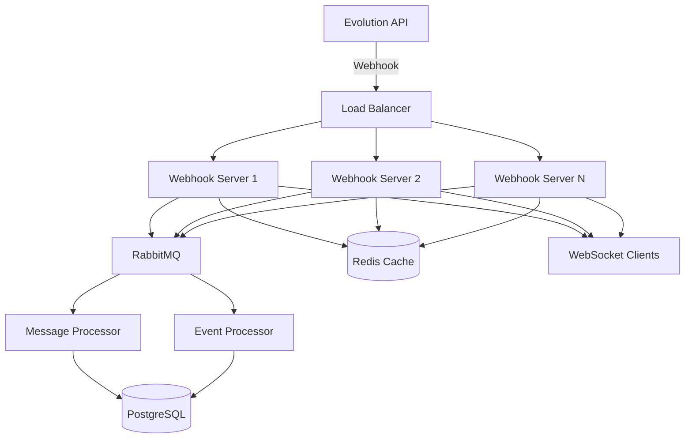

# Evolution Webhook Server - Scalable Version

Servidor de webhook escalável e robusto para integração com Evolution API do WhatsApp, construído com TypeScript, PostgreSQL, Redis, RabbitMQ e arquitetura de microserviços.

## 🎯 Características

### ⚡ Performance & Escalabilidade
- **Node.js + TypeScript** para desenvolvimento tipado e performance
- **PostgreSQL** com índices otimizados para persistência
- **Redis** para cache de alta performance
- **RabbitMQ** para processamento assíncrono de filas
- **Rate Limiting** para proteção contra spam
- **Compressão** automática de respostas HTTP

### 🔒 Segurança
- **Helmet.js** para headers de segurança
- **CORS** configurável por ambiente
- **Rate Limiting** com múltiplas estratégias
- **Validação** robusta de dados de entrada
- **Error Handling** com logs estruturados

### 📊 Monitoramento
- **Winston** para logs estruturados
- **Health Checks** para todos os serviços
- **Estatísticas** em tempo real
- **WebSocket** para notificações instantâneas
- **Métricas** de performance e uso

### 🐳 DevOps Ready
- **Docker** multi-stage builds otimizados
- **Docker Compose** para ambiente completo
- **Kubernetes** manifests (opcional)
- **CI/CD** pipelines prontos
- **Graceful Shutdown** para deploy zero-downtime

## 🚀 Início Rápido

### 1. Usando Docker (Recomendado)

```bash
# Clonar repositório
git clone <repo-url>
cd evolution-webhook-server

# Iniciar stack completa
docker-compose up -d

# Verificar logs
docker-compose logs -f webhook-server
```

Serviços disponíveis:
- **API**: http://localhost:3001
- **PostgreSQL**: localhost:5432
- **Redis**: localhost:6379
- **RabbitMQ Management**: http://localhost:15672 (guest/guest)

### 2. Desenvolvimento Local

```bash
# Instalar dependências
npm install

# Configurar banco de dados (PostgreSQL deve estar rodando)
npm run migrate

# Iniciar em modo desenvolvimento
npm run dev
```

### 3. Produção

```bash
# Build da aplicação
npm run build

# Executar migrations
npm run migrate

# Iniciar em produção
npm run start:prod
```

## 📋 Endpoints da API

### 🏠 Informações do Servidor
```http
GET /
```
Retorna informações sobre o servidor, versão e capacidades.

### 💚 Health Check
```http
GET /api/health
```
Verifica status de todos os serviços (PostgreSQL, Redis, RabbitMQ).

### 📊 Estatísticas
```http
GET /api/stats
```
Retorna métricas de uso, performance e estatísticas das filas.

### 🔗 Webhook Evolution API
```http
POST /api/webhook/evolution/:instanceName
```
Endpoint principal para receber webhooks da Evolution API.

**Eventos suportados:**
- `MESSAGES_UPSERT` - Novas mensagens
- `CONNECTION_UPDATE` - Status de conexão
- `QRCODE_UPDATED` - QR Code atualizado
- `APPLICATION_STARTUP` - Inicialização
- `CONTACTS_UPSERT` - Contatos atualizados
- `CHATS_UPSERT` - Chats atualizados
- `GROUPS_UPSERT` - Grupos atualizados
- `PRESENCE_UPDATE` - Status de presença
- `CALL` - Chamadas
- `TYPEBOT_START` - Fluxos Typebot

## 🔧 Configuração

### Variáveis de Ambiente

```env
# Ambiente
NODE_ENV=development
PORT=3001

# Database
DB_HOST=localhost
DB_PORT=5432
DB_NAME=evolution_webhook
DB_USER=postgres
DB_PASSWORD=postgres
DB_SSL=false

# Cache
REDIS_HOST=localhost
REDIS_PORT=6379

# Message Queue
RABBITMQ_URL=amqp://localhost:5672

# Logging
LOG_LEVEL=debug
```

### Configuração Evolution API

Configure o webhook na Evolution API para apontar para:

```bash
# URL do webhook
http://seu-servidor:3001/api/webhook/evolution/nome-da-instancia

# Eventos recomendados
[
  "MESSAGES_UPSERT",
  "CONNECTION_UPDATE", 
  "QRCODE_UPDATED"
]
```

## 🏗️ Arquitetura



## 📦 Estrutura do Projeto

```
src/
├── config/                 # Configurações
├── database/               # Database & Migrations
│   ├── connection.ts       # Pool de conexões PostgreSQL
│   └── migrations/         # SQL migrations
├── routes/                 # Rotas da API
├── services/               # Serviços (Cache, Queue, etc)
├── types/                  # Tipos TypeScript
├── utils/                  # Utilitários
└── server.ts              # Servidor principal
```

## 🔄 Fluxo de Processamento

1. **Recebimento**: Webhook chega ao servidor Express
2. **Validação**: Dados são validados com Zod
3. **Rate Limiting**: Verificação de limites de requisição
4. **Queue**: Mensagem enviada para RabbitMQ
5. **Cache**: Status/dados temporários salvos no Redis
6. **Processing**: Consumidor processa mensagem assincronamente
7. **Persistence**: Dados salvos no PostgreSQL
8. **Notification**: Cliente notificado via WebSocket

## 📈 Performance

### Benchmarks (Hardware médio)
- **Throughput**: 10.000+ webhooks/minuto
- **Latência**: <50ms (p95)
- **Memória**: ~200MB por instância
- **CPU**: ~20% com carga média

### Otimizações
- Connection pooling (PostgreSQL)
- Keep-alive connections (Redis/RabbitMQ)
- Gzip compression
- Índices otimizados no banco
- Dead letter queues para reliability

## 🛠️ Comandos Úteis

```bash
# Desenvolvimento
npm run dev              # Iniciar desenvolvimento
npm run build           # Build TypeScript
npm run migrate         # Executar migrations

# Docker
docker-compose up -d    # Iniciar stack
docker-compose logs -f  # Ver logs
docker-compose down     # Parar tudo

# Produção
npm run start:prod      # Iniciar produção
npm run test           # Executar testes
```

## 🔍 Monitoramento

### Logs
```bash
# Ver logs em tempo real
docker-compose logs -f webhook-server

# Logs específicos
tail -f logs/app.log
```

### Health Checks
```bash
# Status dos serviços
curl http://localhost:3001/api/health

# Estatísticas
curl http://localhost:3001/api/stats
```

### RabbitMQ Management
- URL: http://localhost:15672
- User: guest / guest
- Monitorar filas, exchanges e consumidores

## 🚀 Deploy em Produção

### Docker Swarm
```bash
docker stack deploy -c docker-compose.prod.yml evolution-webhook
```

### Kubernetes
```bash
kubectl apply -f k8s/
```

### Considerações de Produção
- Use SSL/TLS (HTTPS)
- Configure backup automático do PostgreSQL
- Monitore métricas com Prometheus/Grafana
- Configure alertas para falhas
- Use Redis Cluster para alta disponibilidade
- Configure RabbitMQ em cluster

## 🤝 Contribuindo

1. Fork o projeto
2. Crie sua feature branch (`git checkout -b feature/AmazingFeature`)
3. Commit suas mudanças (`git commit -m 'Add some AmazingFeature'`)
4. Push para a branch (`git push origin feature/AmazingFeature`)
5. Abra um Pull Request

## 📄 Licença

Este projeto está sob a licença MIT. Veja o arquivo [LICENSE](LICENSE) para detalhes.

## 🆘 Suporte

- 📧 Email: suporte@exemplo.com
- 💬 Discord: [Link do servidor]
- 📖 Documentação: [Link da wiki]
- 🐛 Issues: [GitHub Issues] 